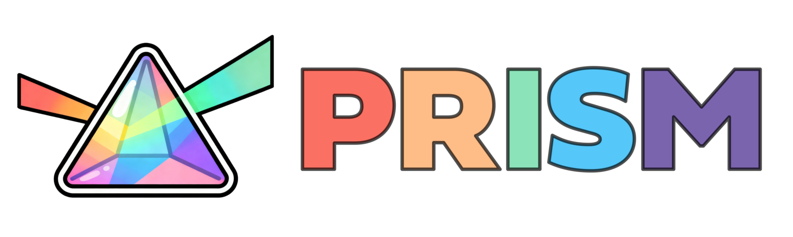
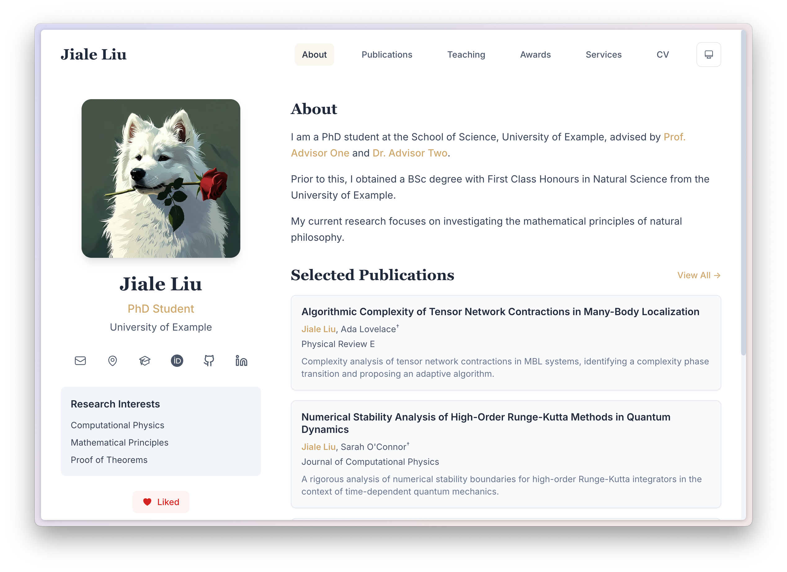

<div align="center">
  
</div>

# PRISM

**English** · [中文](README_cn.md) · [Demo](https://prism-demo.pages.dev)  · [Changelog](CHANGELOG.md)

PRISM stands for **P**ortfolio & **R**esearch **I**nterface **S**ite **M**aker. It is a modern, configurable, and high-performance personal website template built with Next.js, Tailwind CSS, and TypeScript. It is designed for researchers, developers, and academics to showcase their work, publications, and portfolio with ease.



## ✨ Features

*   **📄 Configuration-Driven**: Manage your entire site's content using simple `TOML`, `Markdown`, and `BibTeX` files in the `content/` directory. No code changes required for content updates!
*   **📚 BibTeX Support**: Directly render your publications from a `.bib` file. Includes search, filtering (Year, Type), and automatic citation generation.
*   **🎨 Modern Design**: Clean, responsive UI with a beautiful serif/sans-serif typography pairing, smooth animations (Framer Motion), and Dark Mode support.
*   **⚡️ High Performance**: Built on Next.js 20 with Turbopack. Static export ensures blazing fast load times and easy deployment.
*   **🔍 SEO Optimized**: Dynamic metadata generation for every page.
*   **🧩 Dynamic Routing**: Easily add new pages by simply creating a config file.

## 🚀 Getting Started

### Prerequisites

*   Node.js 15 or later
*   npm, pnpm, or yarn

### Installation

1.  **Clone the repository:**

    ```bash
    git clone https://github.com/xyjoey/PRISM.git
    cd PRISM
    ```

2.  **Install dependencies:**

    ```bash
    npm install
    ```

3.  **Run the development server:**

    ```bash
    npm run dev
    ```

    Open [http://localhost:3000](http://localhost:3000) with your browser to see the result.

## 🛠️ Configuration

All content lives in the `content/` directory.

### 1. Global Site Config (`content/config.toml`)
Configure your site title, author details, social links, and navigation menu here.

```toml
[site]
title = "Your Name"
description = "Personal website of Your Name"
url = "https://your-website.com"

[author]
name = "Your Name"
title = "PhD Student / Researcher"
# ...

[features]
enable_likes = true
```

### 2. Homepage (`content/about.toml`)
Customize the "About" section, "News", and "Selected Publications" on the homepage.

### 3. Publications (`content/publications.bib`)
Export your publications from Google Scholar, Zotero, or Mendeley to `content/publications.bib`. PRISM automatically parses this file to generate your Publications page. Customize the display of publications by changing `selected`, `preview` and `description` keys in the bib file. 

### 4. Adding New Pages
To add a new page (e.g., "Projects"), create a TOML file in `content/` (e.g., `content/projects.toml`) and add it to the `navigation` list in `content/config.toml`.

Supported page types:
*   `text`: Renders Markdown content (Great for CVs, Bio).
*   `card`: Renders a list of cards (Great for Projects, Awards).
*   `publication`: Renders the full publications list with filters.

## 📦 Deployment

PRISM is optimized for static deployment.

```bash
npm run build
```

This generates a static `out/` directory that can be hosted anywhere.

👉 **[Read the full Deployment Guide](docs/deployment.md)** for instructions on deploying to **GitHub Pages** and **Cloudflare Pages**.

## 📂 Project Structure

```
PRISM/
├── content/              # All user-editable content (TOML, BibTeX, MD)
├── public/               # Static assets (images, papers)
├── src/
│   ├── app/              # Next.js App Router
│   ├── components/       # React components
│   ├── lib/              # Utility functions (parsers, config loaders)
│   └── types/            # TypeScript definitions
├── next.config.ts        # Next.js configuration
└── tailwind.config.ts    # Tailwind CSS configuration
```

## 🤝 Contributing

Contributions are welcome! Please feel free to submit a Pull Request.

## 📄 License

This project is licensed under the MIT License - see the [LICENSE](LICENSE) file for details.
